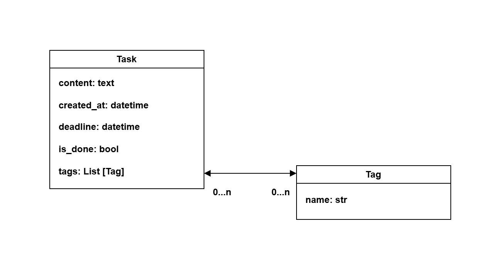
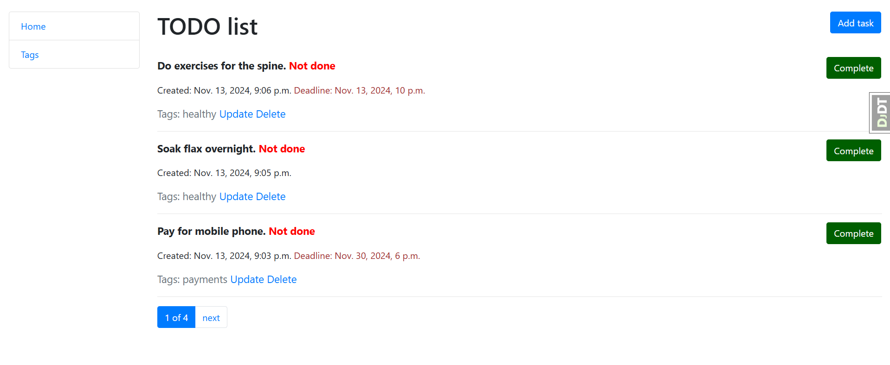

# Todo List
## Notepad (Organizer)

### 👉 Description
Project for managing own tasks with tags.

Purpose is to put life in order and organize tasks in a better way.

You can add, update and delete any tasks and tags.
You can also set deadlines and mark which tasks have already been completed.

### 👉 Installation

Python3 must be already installed

### ✨ How to use it

> Download the code 

```bash
$ # Get the code
$ git clone https://github.com/VladimirDolhyi/todolist.git
$ cd todolist
```

#### 👉 Set Up

> Install modules via `VENV`  

```bash
$ python -m venv venv
$ source venv/bin/activate (on macOS)
$ venv\Scripts\activate (on Windows)
$ pip install -r requirements.txt
```

> Set Up Database

```bash
$ python manage.py makemigrations
$ python manage.py migrate
```
> Run the server

```bash
$ python manage.py runserver
```

### 👉 Features

* Managing tasks and tags directly from website interface
* Powerful admin panel for advanced managing

### 👉 Database Schema


### 👉 Home page



